# Kubernetes核心概念

Kubernetes是一个容器编排平台。

## kubernetes的核心功能

· 服务发现、负载均衡；

· 容器自动装箱（调度），调度就是把容器放到集群的某个机器上，K8S会做存储的编排，让存储的生命周期与容器的生命周期能有一个连接；

· K8S会自动进行容器恢复。集群中如果出现宿主机问题或者操作系统问题导致容器不可用，K8S会自动对不可用的容器进行恢复；

· 对于job类型任务，k8s可以批量执行；

· K8S支持水平伸缩。使集群、应用更富有弹性。


## 三个例子

### 调度


K8S可以把用户提交的容器放到K8S管理的集群的某台节点上。K8S的调度器是执行调度能力的组件。调度器会观察容器的大小、规格。

比如调度器知道了容器需要的CPU和memory，然后再集群中找一个相对比较空闲的机器对容器进行放置（placement）操作。

### 自动修复

K8S有节点健康检查的功能，它会检测集群中所有的宿主机，当宿主机或软件出现故障时，节点健康检查会自动对它进行发现。

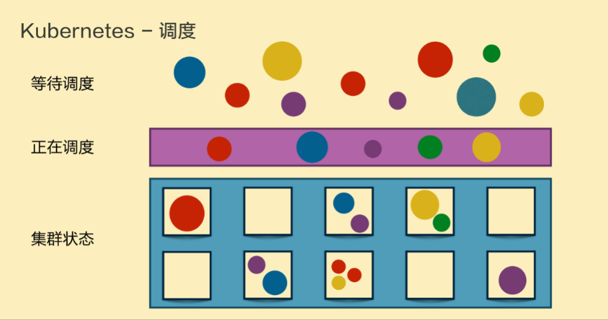

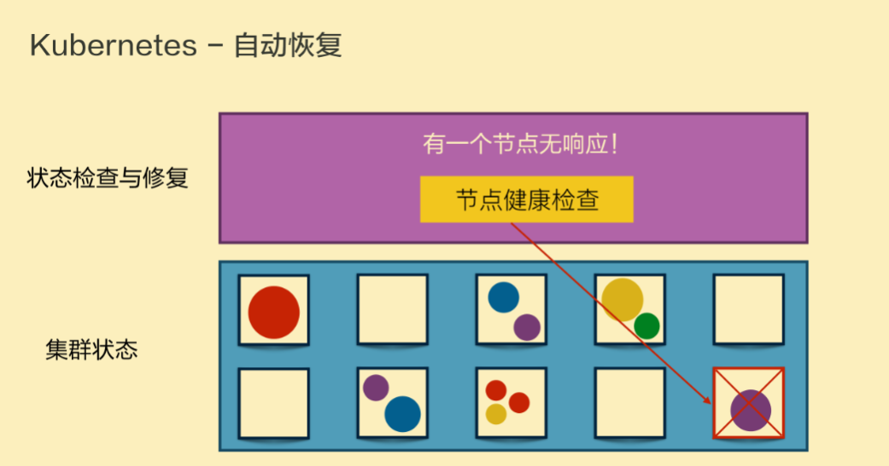

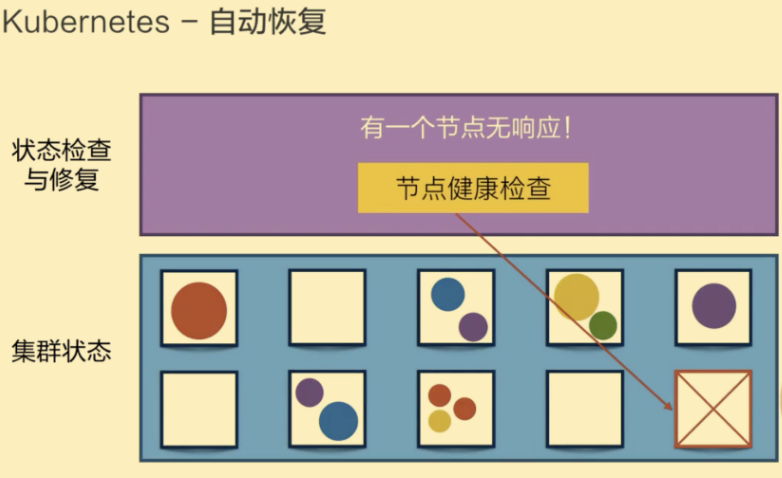

上图展示了原本在一个节点中的容器出现故障（右下角节点的紫色圆点表示故障容器），K8S进行节点健康检查之后在一个新的节点恢复了出故障的容器。

### 水平伸缩

K8S有业务负载检查的能力，它会检测业务上所承担的负载，如果业务本身的CPU利用率过高或者响应时间过高，K8S就会对这个业务进行一次扩容。

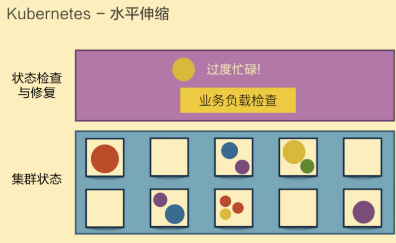

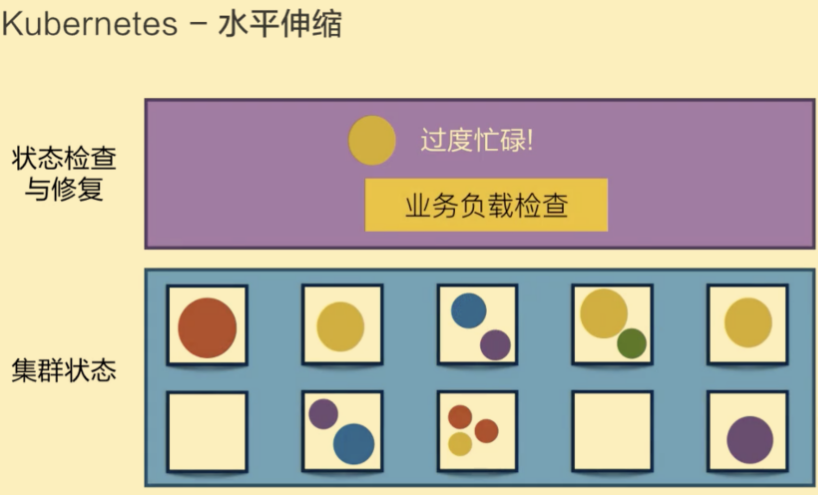

上图例子表示，黄颜色的过度忙碌，K8S把黄颜色负载从一份变为三份。接下来K8S通过负载均衡将原来第一个黄颜色上的负载平均分到三个黄颜色的负载上去，以此来提高响应时间。


## Kubernetes架构

K8S架构是一个典型的二层（C/S）架构。Master作为中央管控节点，与Node进行连接。

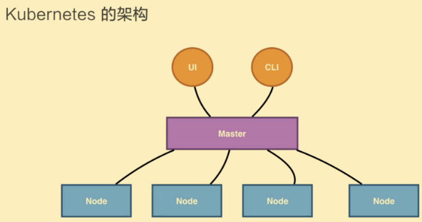

用户通过UI和Master进行连接，把希望的状态或者想要执行的命令告诉master，master会把状态或者命令发给相应的节点，进行最终的执行。

### Master

K8S的master包含四个主要组件: API Server、Controller、Scheduler、etcd。

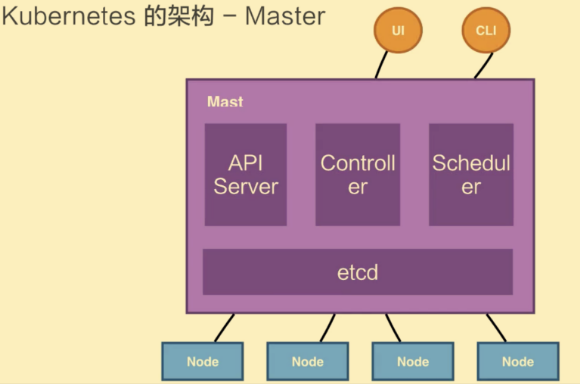

· API Server：用来处理API操作。K8S中所有组件都会与API Server进行连接，组件与组件之间一般不会相互连接，都依赖于API Server进行消息传送；

· Controller：控制器，用来完成对集群状态的管理。比如上面例子提高的对容器进行自动修复、水平扩张等，都是由K8S的控制器完成；

· Scheduler：调度器，顾名思义就是完成调度。比如刚才的第一个例子，根据容器需要的CPU、memory大小将容器放置到合适的节点；

· etcd：etcd是一个分布式的存储系统，API Server中所需要的原信息都被放置在etcd中，etcd本身是一个高可用系统，通过etcd系统保证了kubernetes的master组件的高可用性。

### Node

K8S的Node是真正运行业务负载的（master是管事的，node才是真正干活的），每个业务负载会以pod的形式运行。一个pod中会运行一个或多个容器，真正去运行这些pod的组件叫做***kubelet***, kubelet是node中最关键的组件，它通过API Server接收到所需要的pod的运行状态，然后提交到Container Runtime组件中。

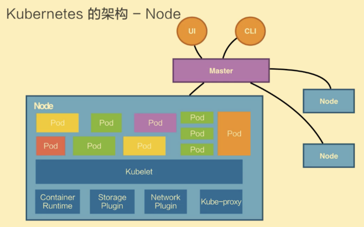

Storage Plugin和Network Plugin分别是对存储和网络进行管理（在操作系统上创建容器所需要的运行环境，最终把容器或pod运行起来，当然需要对存储和网络进行管理）。

在K8S自己的环境中，也会有K8S的network，它是为提供service network进行搭网组网的。Kube-proxy就是真正完成service组网的组件。它是利用了iptable的能力来进行组建kubernetes的network。

K8S的每个node都包含上述几个组件。K8S的Node不会直接和user进行交互，都是通过master进行interaction。


### Kubernetes架构 - 例子

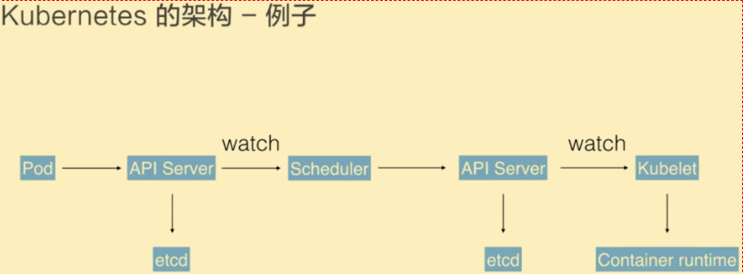

用户提交了一个pod到master（通过UI或者CLI），这个请求首先提交到了master的API Server，API Server会把这个信息写入到存储系统etcd，然后Scheduler通过API Server的watch或者叫做notification的机制得知了信息：有个pod需要被调度，于是scheduler根据它的内存状态进行一次调度决策，完成这次调度决策之后，scheduler告诉API Server这个pod需要被调度到哪个节点上，然后API Server再把这次调度的结果写入到etcd中，记录结果之后API Server会通知相应的节点进行这次pod真正的执行启动。相应节点的kubelet得到通知，kubelet就去调用container runtime来真正去启动配置这个容器和容器的运行环境，去调度storage plugin去配置存储，network plugin去配置网络。


## Kubernetes的几个核心概念

### Pod

Pod是K8S的一个最小调度及资源单元。一个Pod简单地说就是对一组容器的抽象，它里面包含一个或多个容器。用户可以通过Kubernetes的Pod API生产一个Pod，让kubernetes对某个pod进行调度也就是把这个pod放在kubernetes管理的节点上运行起来（找个地方放置然后跑起来就是调度）。

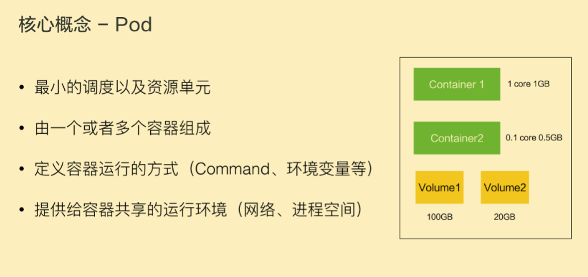

如上图的Pod包含了两个容器，每个容器可以指定它所需要的资源大小。比如说一核一个G，或者0.5核0.5个G。

这个Pod里还包含了一些其他的资源：比如Volume卷存储资源，比如需要100GB的存储或者20GB的另外一个存储。

Pod里面也可以定义容器运行需要的方式。比如说运行容器的command以及环境变量等。 Pod这个抽象给容器提供了一个共享的运行环境，这些容器共享同一个网络环境，这些容器可以用localhost进行直接连接（因为共享相同的网络环境嘛）。而Pod与Pod之间，是互相隔离的（不共享网络环境）。

### Volume

Volume就是卷，是用来管理K8S存储的。也就是Pod中的容器可以访问的文件目录，一个卷可以被挂载在Pod中的一个或者多个容器的指定路径下面。

一个Volume可以支持多种后端存储。比如K8S的Volume就支持很多存储插件，它支持本地的存储，还支持分布式的存储。比如说ceph、GlusterFS。还支持云存储，比如阿里云盘、AWS云盘、谷歌云盘。

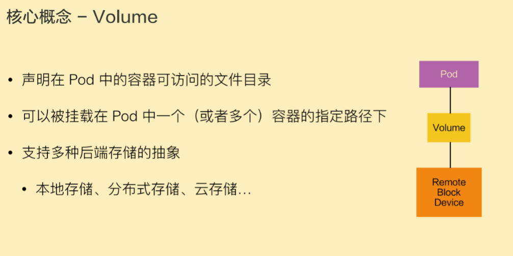

### Deployment

Deployment是比Pod更上一层的抽象。它可以定义一组Pod的副本数目、这个Pod的版本。

一般用Deployment这个抽象做应用的真正管理，而Pod是组成Deployment最小的单元。

K8S是通过控制器Controller去维护Deployment中Pod的数目，它也会去帮助Deployment自动恢复失败的Pod。

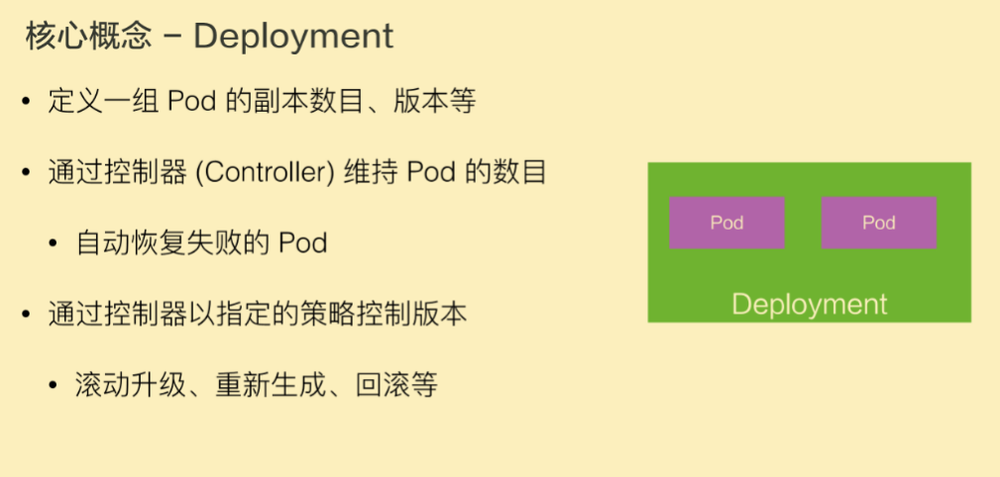

比如定义了一个Deployment，这个Deployment需要两个Pod，当一个Pod失败的时候，控制器就会监测到，它重新把Deployment中的Pod数目从一个恢复到两个，也就是再去生成一个Pod。

控制器也会帮助完成发布的策略，比如滚动升级、重新生成，或者进行版本的回滚。

### Service

Service提供一个或者多个Pod实例的稳定访问地址。

上面说到一个Deployment有两个甚至多个完全相同的Pod。对于一个外部用户来说，访问哪个Pod其实都一样，所以用户只想访问一个固定的VIP，也就是Virtual IP，而不希望知道每一个Pod的具体IP地址。

如果某个Pod失败了，可能会换成一个新的Pod，对于一个外部用户，提供了多个具体的Pod IP地址，这个用户可能要不停的去更新Pod IP地址，这样显然很不方便，***于是希望有一个抽象，可以把对所有Pod的访问能力抽象成一个第三方的IP地址,实现这个K8S的抽象就叫做Service。***

实现Service有多种方式，Kubernetes支持Cluster IP，上面提到的kube-proxy组网也支持nodePort， LoadBalancer等其他的一些访问能力。

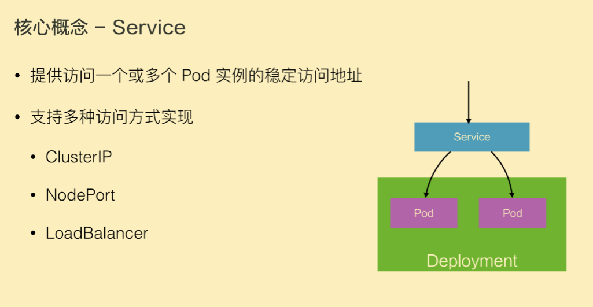

### Namespace

Namespace用来做一个集群内部的逻辑隔离。它包括鉴权、资源管理等。

K8S中的每个资源，比如Pod、Deployment、Service都属于一个Namespace，同一个Namespace中的资源命名需要唯一性，不同的Namespace中的资源可以重名。

例：比如公司内部有很多business unit，每一个BU之间需要有一个视图上的隔离，并且在鉴权和CUDA上也不一样，于是就会用Namespace来给每一个BU提供他所看到的隔离机制。

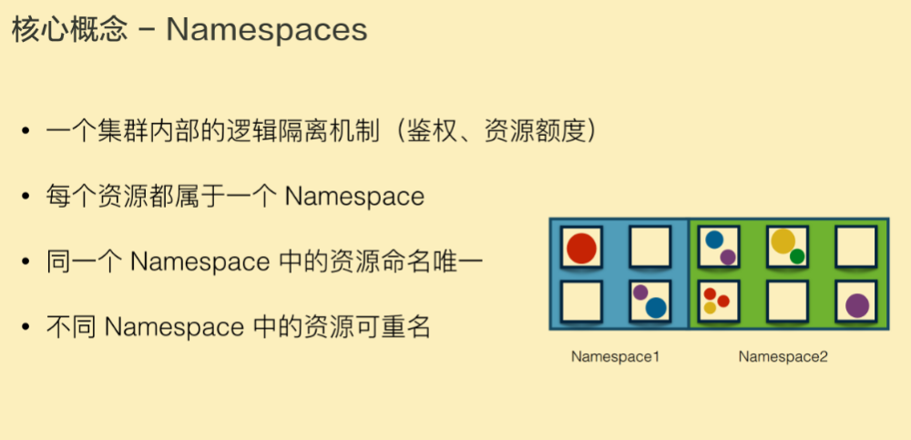


## Kubernetes API

**Kubernetes的API由 HTTP + JSON/YAML 组成。**

用户访问的方式是HTTP，访问的API中的内容是JSON/YAML格式的。

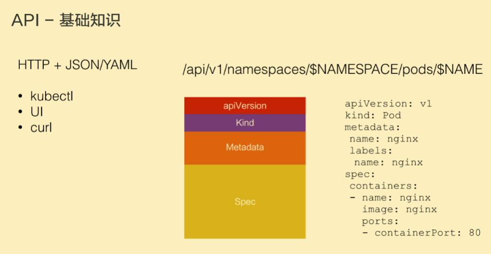

如上图这个Pod类型的资源，它是用HTTP访问的路径，也就是API。

API里按顺序包括apiVersion/v1、$NAMESPACE是这个Pod所属的命名空间、pods（表示是pod资源）、最后的$NAME是这个Pod的名字。

我们提交或者get一个Pod的时候，它的内容都是用JSON或者YAML表达的。上图中的YAML file对Pod资源的描述也分为几个部分。

最开始，一般讲API的version。这个例子中是v1。

之后描述了这个资源的kind（类型）是Pod。

metadata中写了Pod的name（nginx），还给Pod打了一些label（这里只打了一个name： nginx的标签。

Spec是用户希望Pod达到的一个预期的状态。比如说Pod内部需要有哪些container被允许。如上图中这里有一个name是nginx的container，它的镜像是nginx，暴露的端口是80。

当我们从Kubernetes API中去获取这个资源的时候，一般来讲Spec下面会有一个**status**, 它表达了这个资源当前的状态。 比如对于一个Pod，状态可能是正在被调度、已经在running或者是已经被terminate，也就是执行完毕了。

上面提到了metadata里的labels——Label可以是一组键值对（KeyValuePair）。

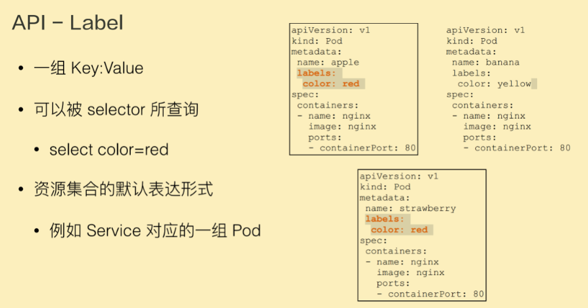

比如下图的第一个Pod中label中包含color是red，当然也可以添加其他label，比如size：big（大小为大的），labels可以是一组键值对。

这些labels可以被选择器selector所查询。这有点类似sql中的select语句。比如上图的三个Pod资源就可以进行select name color等于red，只有左边两个labels中color为red的pod被选中了，右边的pod的labels中的colors是yellow，所以没被选中。

通过labels，K8S就可以在API层对资源进行筛选。

例如上面介绍的Deployment，它可能是代表一组的Pod，它是一组Pod的抽象，一组Pod就要通过label selector来表达。 上面还提到service对应的一组pod，也就是一个service要对应一个或者多个pod，来对它们进行统一的访问，这个描述也是通过label selector来进行select选取的一组Pod。


## 一个Demo

```这是最开始的集群样子```

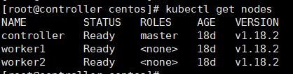

### 1、提交一个nginx的deployment ——deployment.yaml

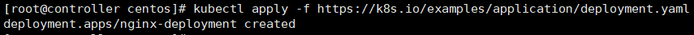

```kubectl get deployment发现，创建了两个nginx的pod```

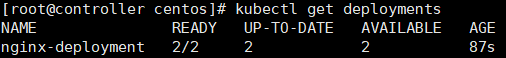

```可以先观察一下这个yaml文件```

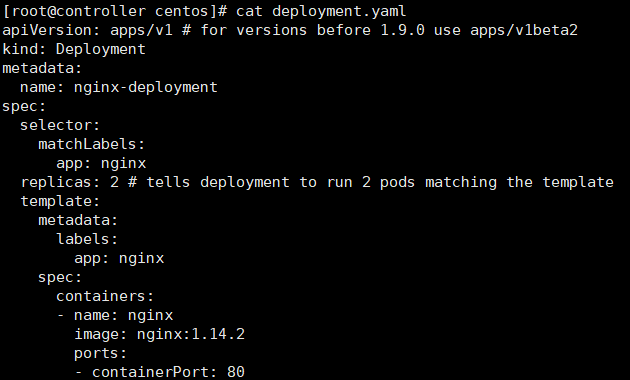

可以发现这个yaml文件是一个deployment (kind: deployment), 这个deployment是要创建一个nginx应用，name是nginx-deployment, 副本数量(replicas)为2，nginx的版本为1.14.2(image: nginx:1.14.2)

```命令kubectl describe deployment nginx-deployment可以用来表述一下这个deployment```

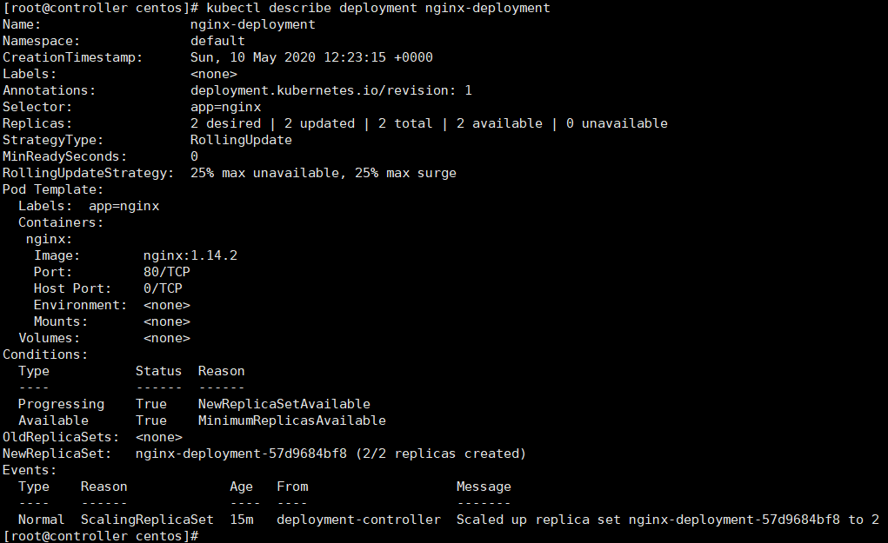

从上图可以发现：确实生成了一个name是nginx-deployment的deployment，他的selector是app=nginx，副本数量是2 desired | 2 update ...... 反正就是我们想要的。

其他注意的就是下面的image版本是nginx：1.14.2。最后的from显示deployment-controller说明是控制器管理deployment的生成。

### 2、升级应用 ——deployment-update.yaml

```在进行下一步升级操作之前我们先康康升级deployment的yaml文件```

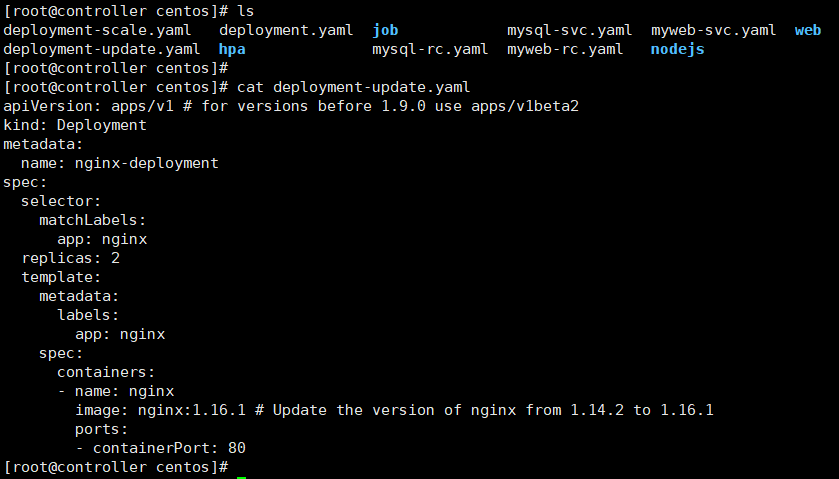

可以看到副本数量还是2，把nginx的版本从1.14.2升级到1.16.1

```kubectl apply -f deployment-update.yaml```

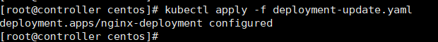

```kubectl describe deployment nginx-deployment， 看一下有什么变化```

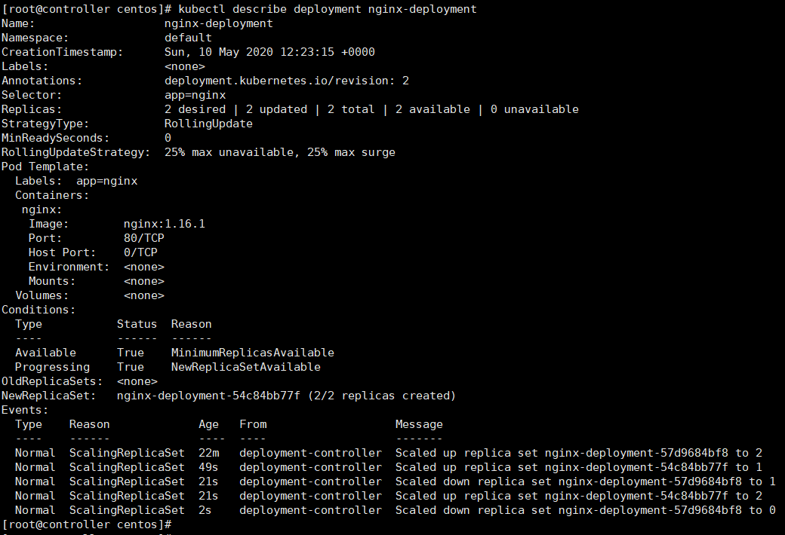

可以看到，nginx的版本确实升级到了1.16.1

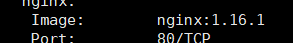

### 3、水平扩容——deployment-scale.yaml

老样子，操作之前先看deployment-scale.yaml文件。

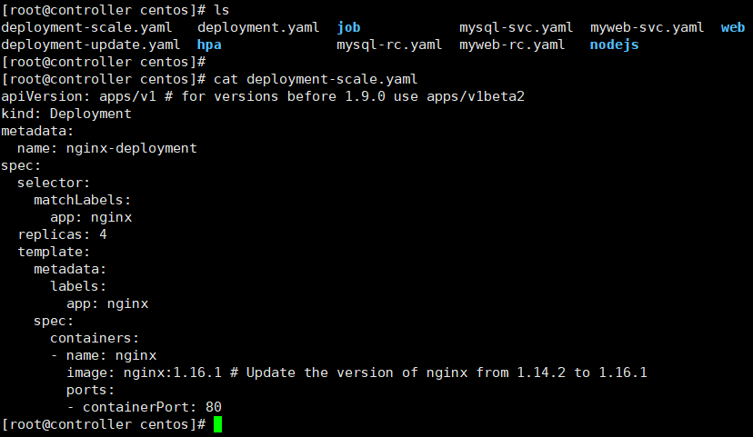

可以看见副本数量是4，所以正常的话应该创建4个版本为nginx:1.16.1的Pod。

```kubectl apply -f deployment-scale.yaml```

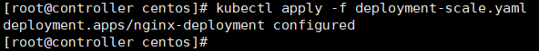

```kubectl describe deployment nginx-deployment 描述一下这个deployment```

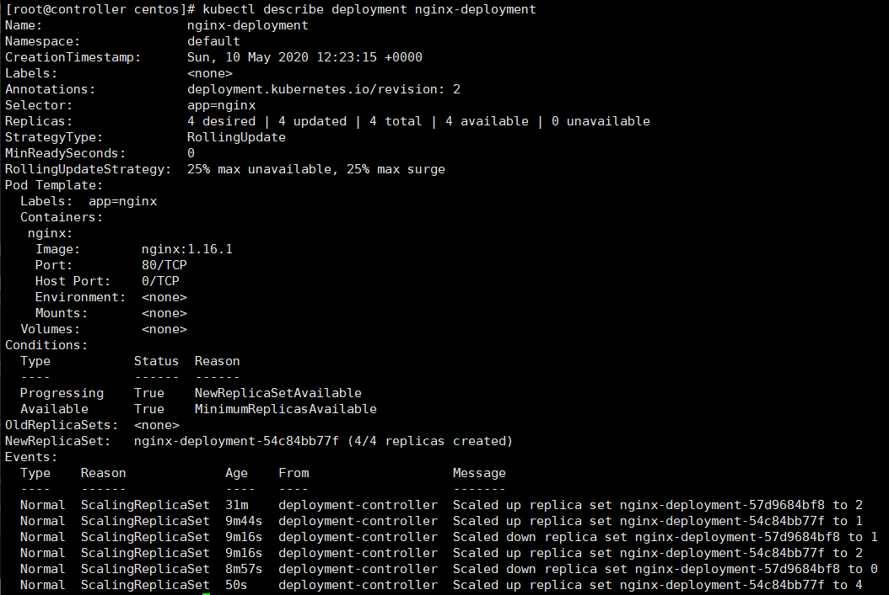

能看到副本数量变为4了

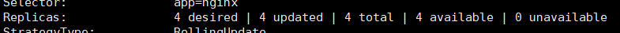


### 4、删除deployment

用命令```kubectl delete deployment nginx-deployment```来删除deployment

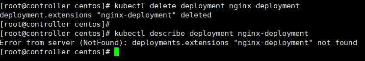

可以看到这个时候再kubectl describe deployment就会报错了，说明deployment已经成功删除了。

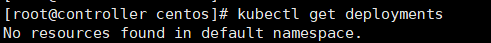
