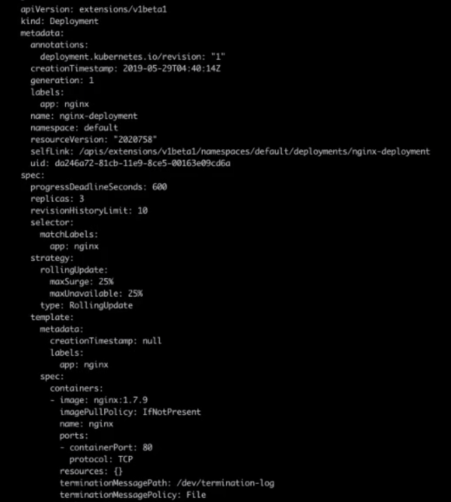
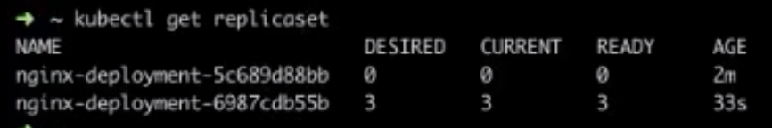
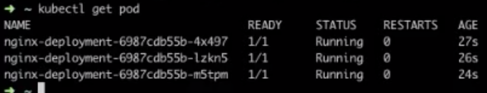
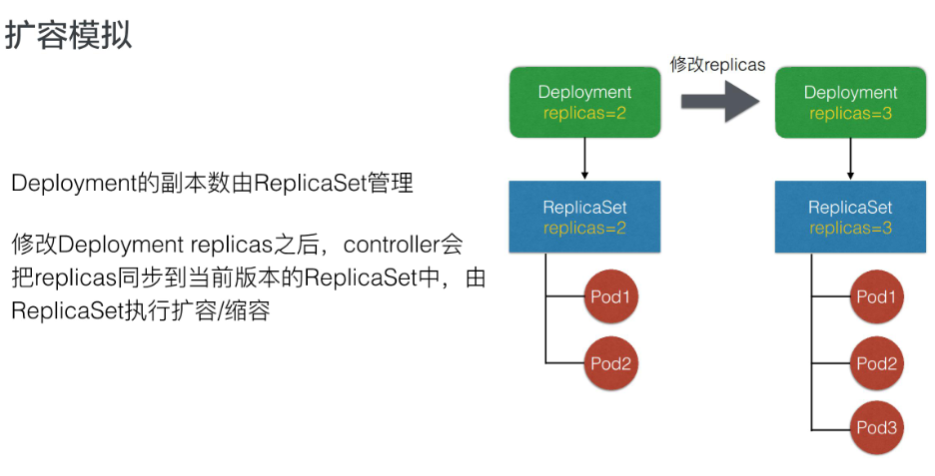

# 应用编排与管理：Deployment

## 一、需求来源


背景问题：如果我们直接管理集群中所有Pod，应用A、B、C的Pod，其实是散乱分布在集群中的。

· 如果直接管理所有Pod，首先无法保证集群内可用Pod的数量，例如应用A四个Pod如果出现一些宿主机故障或者网络问题，如何保证它可用的数量？

· 直接管理所有Pod还有一个如何为所有Pod更新镜像版本的问题。是否需要某一个Pod去重建新版本的Pod？

· 更新过程中如何保证服务可用性？更新过程中发现问题如何快速回滚到上一个版本？

### Deployment：管理部署发布的控制器

由于上面的问题，于是便有了Deployment。


如上图所示，Deployment将应用A、B、C分别规划到不同的Deployment中，每个Deployment管理一个相同应用的一组Pod，这组Pod我们认为它是相同的一个副本。Deployment做了这几件事情：

1、首先Deployment定义了一个Pod的期望数量。比如应用A，我们期望Pod的数量是4个。然后controller就会持续维持pod数量为期望的数量。当我们的pod出现了宿主机问题或者网络问题，controller帮我们恢复，就是通过新扩出来对应的pod，来保证可用的pod数量与期望数量一致。

2、Deployment还会配置pod的发布方式。也就是controller会按照用户给定的策略来更新pod，更新过程中可以设定不可用pod数量要在多少范围内。

3、更新过程中出现问题的话，是可以“一键回滚”的。即可以通过一条命令或者一行修改能够将Deployment下面所有pod更新为某个旧版本。


## 二、用例解读

举例：一个简单的Deployment的yaml文件


"apiVersion: apps/v1" ——Deployment当前所属的组是apps，版本是v1。

“kind：Deployment” ——这是一个Deployment的yaml文件

“metadata” 是Deployment的元信息。之前的课程说过元信息包括lables、selector、pod.image等。

deployment作为一个K8S资源有自己的metadata元信息。

"name: nginx-deployment" ——这里定义了deployment.name为nginx-deployment。

"labels:

​     app: nginx" ——这里还定义了标签为app：nginx

Deployment的spec字段里还包含了“replicas：3”，replicas就是期望的pod数量；selector就是pod的选择器，所有扩容出来的pod，它的labels必须匹配selector层上的image.labels，也就是app.nginx。

template字段就是pod的模板，这个template包含了两个部分：

· 一部分是我们期望的Pod的metadata，其中包含了labels，即跟selector.matchLabels相匹配的一个labels。

· 另一部分是pod.spec。这里的pod.spec就是deployment最终创建出来pod时候所用到的pod.spec，这里定义了一个container.nginx，它的镜像版本是nginx: 1.7.9。

作个小总结：

· replicas：deployment中期望的或者终态的数量。

· template：pod相关的一个模板。

### 查看deployment状态

当我们创建了一个deployment的时候，可以通过kubectl get deployment看到deployment总体的一个状态。

 

DESIRED: 期望的pod数量是3个；

CURRENT: 当前实际的pod数量是3个；

UP-TO-DATE: 到达最新的期望版本的pod数量也是3个；

AVAILABLE: available表示运行过程中可用的pod数量。这里available其实并不简单是可用的（ready状态的），其实还包含了一些可用且超过一定时间长度pod；

AGE: deployment创建的时长为80分钟。

### 查看pod

```kubectl get pod```可以查看一下pod


结果有三个pod。

pod名字的格式为:

```${deployment-name}-${template-has}-${random-suffix}```

也就是```deployment的名字-pod模板的哈希-随机的字符串```

上面例子中deployment的名字是nginx-deployment，这就是pod所属的deployment.name; 中间一段pod模板的哈希都是一样的，这是因为这三个pod都是用同一个模板创建的；最后随机的字符串不一样。

再用```kubectl get pod/${deployment-name}-${template-hash}-${random-suffix} -o yaml```来获取pod的yaml文件信息，可以看到pod的OwnerReference，即pod所属的controller资源的kind并不是deployment而是一个replicaset。这个replicaset的name是nginx-deployment-${template-hash}。也就是说，***所有的pod都是ReplicaSet创建出来的，而ReplicaSet对应某一个具体的Deployment.template版本。***

### 更新镜像


对给定的Deployment更新它所有pod的镜像版本可以执行一个kubectl命令：

```kubectl set image deployment/${deployment.name} ${pod.name}=${pod.version}```

如上图的例子，首先kubectl后面有一个set image（设置镜像）的固定写法；

其次是deployment.v1.apps，这也是一个固定写法，写的是我们要操作的资源类型，deployment是资源名、v1是资源版本、apps是资源组，这里可以简写为deployment或者deployment.apps，比如写为deployment的apps组的v1版本；

第三部分是要更新的deployment的name，这里是nginx-deployment;

再后面的nginx其实指的是模板，也就是pod的container.name；

最后指定这个期望这个容器更新的镜像版本。这里指定为nginx: 1.9.1。

当执行完这项命令后，可以看到deployment中的template.spec已经更新为nginx: 1.9.1。

### 快速回滚

如果在发布过程中遇到问题，可以快速回滚。

命令是```kubectl rollout undo deployment/${deployment-name}```

再加上```--to-revision=${version_number}```可以指定回滚到某一个具体的版本。


### DeploymentStatus（Deployment的状态）

***每一个资源都有它的spec.status，Deployment也不例外。***


上图描述了Deployment的三个状态: processing、complete和failed。

Processing: 指的是Deployment正处于扩容和发布中（快了，已经在做了！）。比如processing状态的deployment，它所有的replicas及pod副本全部都达到了最新版本并且是available的，这个deployment就会转为complete状态。

Complete：顾名思义就是完成状态。如果在complete状态要进行一些扩缩容，那就又转入了processing状态。

Failed: 如果在处理过程中遇到一些问题：比如拉取镜像失败啦，readiness probe检查失败啦之类的，就会进入failed状态。中间运行时发生一些pod readiness probe检查失败的时候deployment也会进入failed状态。进入failed状态之后，除非所有replicas都变为avialable且updated为最新版本deployment才会重新进入complete状态。


## 操作演示

这里阿里又把yaml文件鸽了，我只好ctrl + v文字版教程了。

### Deployment 创建及状态

 

下面我们来进行操作演示：这里连接一个阿里云服务集群。我们可以看到当前集群已经有几个可用的 node。

 


 

首先创建对应的 deployment。可以看到 deployment 中的 desired、current、up-to-date 以及 available 已经都达到了可用的期望状态。

 


 

### Deployment 的结构

 

这里看到 spec 中的 replicas 是三个，selector 以及 template labels中定义的标签都是 app：nginx，spec 中的 image 是我们期望的 nginx: 1.7.9；status 中的 available.replicas，readReplicas 以及 updatedReplicas 都是 3 个。

 



 

### Pod 状态

 

我们可以再选择一个 Pod 看一下状态：

 

可以看到：Pod 中 ownerReferences 的功能是 ReplicaSet；pod.spec.container 里的镜像是 1.7.9。这个 Pod 已经是 Running 状态，而且它的 conditions.status 是“true”，表示它的服务已经可用了。

 


 

### 更新升级

 

当前只有最新版本的 replicaset，那么现在尝试对 deployment 做一次升级。

 


 

“kubectl set image”这个操作命令，后面接 “deployment”，加 deployment.name，最后指定容器名，以及我们期望升级的镜像版本。

 


 

接下来我们看下 deployment 中的 template 中的 image 已经更新为 1.9.1。

 


 

这个时候我们再 get pod 看一下状态。

 


 

三个 pod 已经升级为新版本，pod 名字中的 pod-template-hash 也已更新。

 



 

可以看到：旧版本 replicaset 的 spec 数量以及 pod 数量是都是 0，新版本的 pod 数量是 3 个。

 

假设又做了一次更新，这个时候 get.pod 其实可以看到：当前的 pod 其实是有两个旧版本的处于 running，另一个旧版本是在删除中；而两个新版本的 pod，一个已经进入 running，一个还在 creating 中。

 

这时我们可用的 pod 数量即非删除状态的 pod 数量，其实是 4 个，已经超过了 replica 原先在 deployment 设置的数量 3 个。这个原因是我们在 deployment 中有 maxavailable 和 maxsugar 两个操作，这两个配置可以限制我们在发布过程中的一些策略。在后面架构设计中会讲到这个问题。

 


 

### 历史版本保留 revisionHistoryLimit

 

上图看到，我们当前最新版本的 replicaset 是 3 个 pod，另外还有两个历史版本的 replicaset，那么会不会存在一种情况：就是随着 deployment 持续的更新，这个旧版本的 replicaset 会越积越多呢？其实 deployment 提供了一个机制来避免这个问题：在 deployment spec 中，有一个 revisionHistoryLimit，它的默认值为 10，它其实保证了保留历史版本的 replicaset 的数量，我们尝试把它改为 1。

 


 


 

由上面第二张图，可以看到两个 replicaset，也就是说，除了当前版本的 replicaset 之外，旧版本的 replicaset 其实只保留了一个。

 

### 回滚

 

最后再尝试做一下回滚。首先再来看一下 replicaset，这时发现旧版本的 replicaset 数量从 0 个增到 2 个，而新版本的 replicaset 数量从 3 个削减为 1 个，表示它已经开始在做回滚的操作。然后再观察一下， 旧版本的数量已经是 3 个，即已经回滚成功，而新版本的 pod 数量变为 0 个。

 


 

我们最后再 get pod 看一下：

 



 

这时，3 个 pod.template-hash 已经更新为旧版本的 hash，但其实这 3 个 pod 都是重新创建出来的，而并非我们在前一版本中创建的 3 个 pod。换句话说，也就是我们回滚的时候，其实是创建了 3 个旧版本的 pod，而并非把先前的 3 个 pod 找回来。


## 四、架构设计

### 管理模式


管理模式：Deployment只负责管理不同版本的ReplicaSet，由ReplicaSet管理具体的pod副本数，每个replicaset对应的deployment template的一个版本。从上面的例子可以看出，每一次修改template，都会生成一个新的ReplicaSet，这个replicaset底下的pod其实都是相同的版本。

从上图可以看出：Deployment创建ReplicaSet，而ReplicaSet创建pod。他们的OwnerReference其实都对应了其控制器的资源

### Deployment控制器


Deployment控制器实现原理如上图。

首先，所有的控制器都是通过Informer中的事件Event做一些Handler和Watch。这里Deployment控制器其实是关注Deployment和ReplicaSet中的event，收到事件后会加入到队列中。Deployment Controller从队列中取出（事件）之后，它的逻辑会判断（check paused)，这个paused就是deployment是否需要新的发布，如果paused为true的话，就表示这个deployment只会做一个数量上的维持，不会做新的发布。

上图中可以看到check paused为yes/true的话，就制作sync replicas。就是把replicas sync同步到对应的ReplicaSet中，最后再update deployment status，那么controller这一次的replicaset就结束了。

如果check paused为false的话，它就会rollout,通过create或者rolling的方式做更新，更新的方式也是通过create/update/delete这种replicaset的方式实现的。

### ReplicaSet控制器


当Deployment分配了ReplicaSet之后，ReplicaSet控制器本身也从Informer中watch一些事件，这些事件包含了ReplicaSet和Pod的事件。从队列中取出事件以后，ReplicaSet controller的逻辑很简单，就只管理副本数。即如果controller发现期望数量比pod数量大的话就会扩容，如果发现实际数量超过期望数量的话就会缩容/删除pod。

从上面两个图中可以看出，deployment的控制器做的事情比replicaset控制器做的事情更复杂，包含了版本管理，而它把每一个版本下的数量维持工作交给ReplicaSet来做

### 扩/缩容模拟



上图是扩容模拟，原本deployment的副本数是2，对应的replicaset有pod1和pod2。之后我们修改了deployment的副本数为3，controller就会把replicas同步到当前版本的ReplicaSet中，这个replicaset发现当前只有两个pod，不满足数量3个，于是创建了一个新的pod3。

### 发布模拟

发布的情况稍微复杂一些。


如上图所示，Deployment初始的模板为template1，对应的replcaset为ReplicaSet1下有三个Pod: pod1、pod2、pod3。这时我们修改了template中的镜像Image。于是模板就变为template2，对应的replicaset为ReplicaSet2。controller这时会逐渐修改两个replicaset中pod的数量，它会逐渐增加ReplicaSet2中pod的数量直到达到期望数量，并逐渐减小ReplicaSet1中pod的数量直到为0。

最终的状态是：ReplicaSet2下有新版本的三个pod: pod4、pod5、pod6,而旧版本的Pod1~3被删除了。这样就完成了一次发布。

### 回滚模拟

假设刚才的发布模拟pod4～6已经发布完成，但这时发现了新版本的问题，于是要做回滚回退到之前的版本，不管是通过rollout命令还是通过回滚修改template,其实都是把模板回滚为原来的旧版本template1。


这里有点类似发布模拟了，也是逐渐增加ReplicaSet1中pod的数量直到达到期望数量，逐渐减小ReplicaSet2中pod的数量直到为0。

这里要注意ReplicaSet下的pod不再是pod1～3，而是pod7～9。***说明回滚操作不是把原来的pod找回来，而是重新创建符合旧版本template的pod***。

### spec字段解析

来康康deployment中其他的spec字段。


· MinReadySeconds: Deployment会根据pod的状态是否为ready来判断它是否可用。但也不是这么简单，设置了MinReadySeconds之后，pod必须持续ready状态超过MinReadySeconds之后才被判断为available。即pod ready是pod available的必要非充分条件。

· revisionHistoryLimit：保留历史revision（修改的版本）数量，默认值为10个。因为如果经常回滚的话回滚列表会太长，所以有时可以只保留部分版本就ok啦。

· paused：paused是标识，paused为true时deployment只做数量维持，不做新的发布。

· progressDeadlineSeconds: 前面提到deployment处于扩容或发布状态时它的condition会处于一个processing的状态，processing可以设置一个超时时间，如果超过了这个时间还是processing，controller就认为这个pod进入failed状态。

### 升级策略字段解析

Deployment在滚动升级RollingUpdate中主要提供了两个策略：一个是MaxUnavailable，另一个是MaxSurge。

**MaxUnavailable: 滚动过程中最多有多少个pod不可用；**

**MaxSurge: 滚动过程中最多存在多少个Pod超过预期replicas数量。**


比如前面的例子，replicaset都为3的deployment在发布的时候可能存在一个情况：新版本的replicaset和旧版本的replicaset都可能有两个pod，加起来就是4个，超过了我们期望的数量3个。这是因为默认的MaxUnavailable和MaxSurge都是25%，默认Deployment在发布的过程中可能有25%的replica是不可用的，也可能超过replica数量25%是可用的，最高可达125%replica数量。

这里可以根据用户实际场景做设置。比如用户资源足够，并且比较注重发布过程中的可用性，就可以设置MaxUnavailable比较小，MaxSurge较大。但如果用户资源紧张，就可以设置MaxSurge较小，甚至为0。

***不过要注意MaxSurge和MaxAvailable不能同时为0！***

理由不难理解：如果MaxSurge为0，必须先删除pod才能扩容pod；如果不删除pod是无法扩容pod滴，因为那样数量会超过期望数量（MaxSurge为0呢），但是MaxUnavaliable不能保证ReplicaSet中有pod是available的，这样就会产生问题。所以说MaxSurge和MaxAvailable不能同时为0。用户可以根据实际场景设置合理的MaxSurge和MaxAvailable值。
