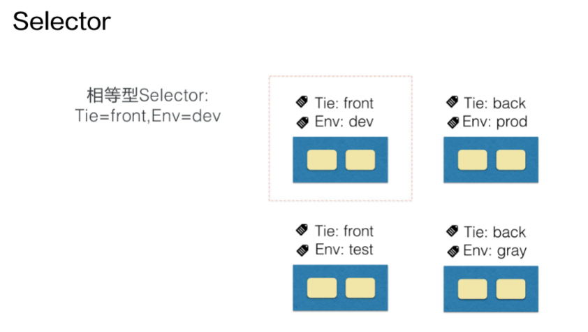

# 应用编排与管理：核心原理

## 一、资源元信息（metadata）

### 1、Kubernetes资源对象

Kubernetes资源对象主要包括了Spec和Status两部分。Spec部分描述了期望的状态，Status部分描述观测到的状态。

K8S还有另外一个部分：元数据部分。

元数据部分主要包括：

· 用来识别资源的标签**Labels**

· 用来描述资源的注解**Annotations**

· 用来描述多个资源之间相互关系的**OwnerReference**


### 2、labels

Labels是资源标签。资源标签是一种具有标识型的Key: value元数据。


上图的前三个例子的标签都打在Pod上。分别标识了Pod对应的应用环境，发布的成熟度和应用的版本。 

从应用标签的例子可以看到，标签的名字包括了一个域名的前缀，用来描述打标签的系统和工具。

第四个标签打在Node对象上，还在域名前增加了版本的标识beta字符串。

### 3、Selector

Selector用来对Labels进行筛选。最常见的Selector就是相等型Selector。


假设系统中有上图四个Pod，每个Pod都有标识系统层级和环境的标签。可以用Tie：front这个标签匹配左边两个Pod。



相等型Selector还可以包括多个相等条件，多个相等条件之间是逻辑“与”的关系。比如这里Tie=front，Env=dev的Selector，可以筛选到左上角的Pod。


另外一种Selector是集合型的Selector。比如上图Env in（test，gray）的Selector，可以筛选到下面的两个Pod。

这个集合操作是in操作，除了in，还有notin集合操作，比如tie notin（front，back），就会筛选tie既不是front也不是back的Pod。

另外，还可以根据Pod是否存在某label进行筛选。比如：Selector release，就会筛选出所有带release的Pod。

***集合型Selector和相等型Selector，也可以用“，”来连接，同样是标识逻辑“与”的关系！***

### 4、Annotations

Annotations是另外一种重要的元数据。一般是系统或者工具用来存储资源的非标示性信息，可以用来扩展资源的spec/status的描述。


上图给了几个Annotations的例子：

第一个例子存储了阿里云负载器的证书ID，可以看到annotations一样可以拥有域名的前缀，标注中也可以包含版本信息（beta）。

第二个例子存储了nginx接入层（ingress）的配置信息，可以看到annotations中包括“，”这样无法出现在label中的特殊字符。

第三个例子的annotations一般可以在kubectl apply命令行操作后的资源中看到。annotations是一个结构化的数据结构，实际上是一个json串，标记了上一次kubectl操作的资源的json描述。

### 5、OwnerReference

最后一个元数据叫做OwnerReference（所有者），一般就是指集合类的资源。比如说Pod集合，就有replicaset，statefulrest。

集合类资源的控制器会创建对应的归属资源。比如：Replicaset控制器在操作中会创建Pod，被创建Pod的OwnerReference就指向了创建Pod的Replicaset（标示出所有者），OwnerReference使用户可以方便地查找一个创建资源的对象（找到对象的创建者）。


## 二、操作

这里课程没有给出pod1.yaml 和 pod2.yaml，只能自娱自乐了。

（1）

```kubectl get pods```


这些是系统已有的Pod。

（2）

使用```kubectl get pods --show-labels```来展示pod的标签


可以看到labels那一栏有一些诸如name=fronted, app=mysql, app=myweb, name=redis-master之类的标签。

（3）

可以通过```kubeclt get pods mysql-4pjbt -o yaml | less ```这样的命令来查看具体的资源信息，首先查看 mysql-4pjbt pod的信息，用-o yaml的方式输出，可以看到这个pod元数据（metadata）里包含了一个labels的字段，里面有一个label：app：mysql。


（4）

```kubectl label pods mysql-4pjbt env=test```

我想给一个pod打标签，就可以用kubectl label，这里我给pod mysql-4pjbt打了一个env=test


(5)

```kubectl label pods mysql-4pjbt env=dev --overwrite```

上面给pod打的是一个它原本没有的标签，这里我要修改这个env标签为env=dev。可以发现报错了：‘env’ already has a value(test), and --overwrite is false。也就是说env已经存在，并且命令没有加上--overwrite参数，所以覆盖失败了。


再用加上了覆盖参数的命令: kubectl label pods mysql-4pjbt env=dev --overwrite。

再用kubectl get pods mysql-4pjbt --show-labels查看一下标签，可以发现标签成功修改为env=dev。

（6）

```kubectl label pods mysql-4pjbt env-```

上面这个命令用来去掉Pod mysql-4pjbt的env标签。

所以去掉一个标签的格式是**kubectl label pods pod名字 label名字-（label名字加一个减号）**


再查看一下标签，发现env标签确实没了。

（7）

```kubectl get pods --show-labels -l app=myweb```

上面这个命令是用label selector筛选pod。

**label selector是通过 -l 参数进行指定的，这里筛选出有app=myweb这个标签的pod。**


(8)

```kubectl get pods --show-labels -l 'app in (mysql, myweb)'```

这个命令用一个集合型selector筛选出app标签值是mysql或myweb的pod。


相等型的selector格式类似：kubectl get pods --show-labels -l env=dev,tie=front。这里没有有两个标签的pod，就不试了。

（9）

```kubectl annotate pods mysql-4pjbt my-annotate='my annotate,ok'```

这个命令给pod打了一个注解，打注解和打标签是一样的操作，就是把label换成annotate就好了，也是加上k：v，只不过加的不是label的k：v而是annotation的k：v。这里打了一个my-annotation='my annotate,ok'的注解。


（10）

```kubectl get pods mysql-4pjbt -o yaml | less```

再看一下Pod的信息。

可以在元数据里发现了增加的注解my-annotation: my annotate,ok。


OwnerReference由于没有可用的yaml文件，就不做了～～


## 三、控制器模式

### 1、控制循环

控制器模式最核心的就是控制循环的概念。

控制循环中包括了控制器Controller,被控制的系统System，以及能够观测系统的传感器Sensor 三个**逻辑组件**。

注意这些组件都是逻辑的。


如上图所示，外界通过修改资源的预期状态spec来控制资源，控制器会比较spec和status，计算出他们的差值diff，diff会用来决定对系统执行什么样的控制操作，控制操作会使得系统产生新的输出，并被传感器以资源status的形式上报。

控制器的各个组件都是独立自主地运行的，不断地使系统向spec表示终态趋近。

### 2、Sensor

控制循环中逻辑的传感器主要有Reflector、Informer、Indexer三部分组成。


Reflector通过List和Watch K8S Server来获取资源的数据。List用来在Controller重启以及Watch中断的情况下，进行资源的全量更新；而watch则在多次List之间进行增量的资源更新；Reflector在获取新的资源数据后，会在Delta队列中塞入一个包括资源对象信息本身以及资源对象事件类型的Delta记录，Delta队列可以保证同一个对象在队列中仅有一条记录，从而避免Reflector重启List和Watch的时候产生重复的记录。

Informer组件不断地从Delta队列中弹出Delta记录，然后把资源对象交给Indexer，让indexer把资源记录在一个缓存中，缓存在默认设置下是用资源的命名空间来做索引的，并且可以被Controller Manager或多个Controller所共享。之后再把这个事件交给事件的回调函数。

### 3、Controller


控制循环中的控制器组件主要由事件处理函数以及worker组成，事件处理函数之间会相互关注资源的新增、更新、删除的事件，并根据控制器的逻辑去决定是否需要处理。对需要处理的事件，会把事件关联资源的命名空间以及名字塞入一个工作队列中，并且由后续的worker池中的一个Worker来处理，工作队列会对存储的对象去重，从而避免多个worker处理同一个资源的情况。worker在处理资源对象时，一般需要用资源的名字来重新获得最新的资源数据，用来创建或者更新资源对象，或者调用其他的外部服务，worker如果处理失败的时候，一般情况下会把资源的名字重新加入到工作队列中，从而方便之后进行重试。

### 4、控制循环例子 - 扩容


ReplicaSet是一个用来描述无状态应用的扩缩容行为的资源，ReplicaSet controller通过监听ReplicaSet资源来维持应用希望的状态数量，ReplicaSet中通过selector来匹配所关联的Pod，在这里考虑ReplicaSet rsA的replicas从2改为3的场景。


首先，Reflector会watch到ReplicaSet和Pod两种资源的变化。

发现ReplicaSet发生变化后，在delta队列中塞入了rsA对象，而且类型是更新的记录（Type=Updated）。

Informer一方面把新的ReplicaSet更新到缓存中，并与Namespace nsA作为索引。另一方面，调用update的回调函数，ReplicaSet控制器发现ReplicaSet发生变化后会把字符串的nsA/rsA字符串塞入到工作队列中，工作队列的一个worker从工作队列中去到了nsA/rsA这个字符串的key，并且从缓存中取到了最新的ReplicaSet数据。

worker通过比较ReplicaSet中spec和status里的数值，发现需要对ReplicaSet进行扩容，因此ReplicaSet的worker创建了一个pod，这个pod中的OwnerReference取值为ReplicaSet rsA。


然后Reflector Watch到新的Pod新增事件，在delta队列中额外加入了Add类型的data记录，一方面把新的Pod记录通过Indexer存储到了缓存中，另一方面调用了ReplicaSet控制器的Add回调函数，Add回调函数通过检查pod ownerReferences找到了对应的ReplicaSet，并把包括ReplicaSet命名空间和字符串塞入到工作队列中。

ReplicaSet的Worker在得到新的工作项之后，从缓存中取到了新的ReplicaSet记录，并得到了这个replicaset新建的pod，因为replicaset的状态不是最新的，也就是所有创建pod的数量不是最新的。因此此时ReplicaSet更新status使得spec和status达成一致。


## 四、控制器模式总结

### 1、两种API设计方法


**Kubernetes控制器模式依赖声明式的API。**

还有一种API设计方法是命令式API。

首先比较一下两种API在交互行为上的差别。

在容器编排体系中，命令式API就是通过向系统发出明确的操作来执行的。声明式API就会给出预期的状态，比如执行一个应用实例副本数保持在3个，而不是明确的去扩容Pod或者删除已有的Pod来保证副本数是3个。

### 2、命令式API的问题

***· 命令式API最大的问题在于错误处理！***

在大规模的分布式系统中，错误是无处不在的。一旦发出的命令没有响应，调用方只能通过反复重试的方式来试图恢复错误，然而盲目重试可能带来更大的问题。

假设原来的命令，后台实际上已经执行完成了，重试后又多执行了一个重试的命令操作。为了避免重试的问题，系统往往还需要在执行命令前，先记录一下需要执行的命令，并且在重启等场景下，重做待执行的命令，而且在执行的过程中需要考虑多个命令的先后顺序、覆盖关系等复杂的逻辑情况。

实际上许多命令式的交互系统在后台还会做一个巡检的系统，用来修正命令处理超时、重试等一些场景造成的数据不一致问题。然而巡检逻辑和日常操作逻辑不一样，往往在测试上覆盖不够，在错误处理上不够严谨，具有很大的操作风险，因此很多巡检系统都是人工触发的。

命令式API在处理并发访问时也容器出问题。

加入多方并发地对一个资源请求操作，如果一旦其中有操作出现了错误，就需要重试。那最后哪一个操作生效了就很难确认，也无法保证。很多命令式操作系统在操作前对系统加锁，从而保证整个系统最后生效行为的可预见性，但是加锁行为会降低整个系统的操作执行效率。


***· 相对的，声明式API系统里天然地记录了系统现在和最终的状态。***

不需要额外的操作数据。另外因为状态的幂等性，可以在任意时刻反复操作。在声明式系统运行的方式里，正常的操作实际上就是对资源状态的巡检，不需要额外开发巡检系统，系统的运行逻辑也能够在日常的运行中得到测试，因此整个系统的稳定性能够得到保证。

由于资源的最终状态是明确的，我们可以合并多次对状态的修改。可以不需要加锁，就支持多方的并发访问。

### 3、控制器模式总结

1、Kubernetes所采用的控制器模式，是由声明式API驱动的。确切地说是基于对Kubernetes资源对象的修改来驱动的。

2、Kubernetes资源之后是关注该资源的控制器。这些控制器将异步的控制系统向设置的终态趋近。

3、这些控制器是自主运行的，使得系统的自动化和无人值守成为可能。

4、因为Kubernetes的控制器和资源都是可以定义的，因此可以方便的扩展控制器模式。特别是对于有状态应用，我们往往可以通过自定义资源和控制器的方式，来自动化运维操作（这就是后续会介绍的operator场景）。


