# 理解Pod和容器设计模式

1、为什么需要Pod；

2、Pod的实现机制；

3、详解容器设计模式。

### 一个操作系统里的例子

比如我们现在在Linux里跑一个HelloWorld程序，这个程序实际上由一组线程组成，分别是{api、main、log、compute}。四个线程共同协作，共享HelloWorld程序的资源，组成了HelloWorld程序的真实工作情况。

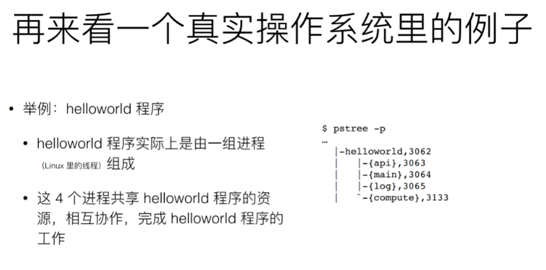

真实的操作系统中往往是根据进程组来对程序进行管理的，为什么？

因为程序中的多个进程/线程会共享一些资源和文件。

现在做一个类比。Kubernetes类比操作系统，容器类比进程，那么进程组呢？ 当然就是Pod啦！

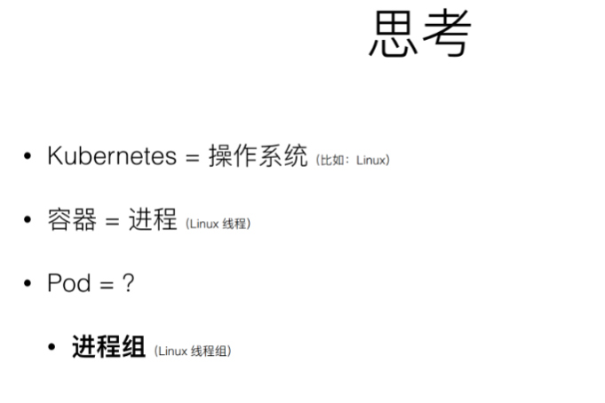

要把一个HelloWorld程序跑起来，最自然的想法应该是起一个Docker容器，容器里放api、main、log、compute这四个进程。

但是这样会引入一个问题，就是容器中PID = 1的进程应该是谁呢？假设是main吧，那谁去管理剩下三个进程呢？

产生这个问题的原因就是容器实际上是一个“单进程模型”，这并不是说容器里只能放一个进程；而是说容器的应用等于进程，所以容器只能去管理PID = 1的进程，其他的进程就只能是托管（孤儿）状态了。

那我们再假设HelloWorld这个程序具有system的能力，或者我们直接把容器里PID = 1的进程直接改为systemd，否则这个容器没办法管理多个进程。

但是这样又有问题，本来PID = 1的进程是应用本身，现在是systemd了，如果把PID = 1的进程kill了，或者它自己挂了，剩下的进程就没有人回收了，这是第一个问题。

第二个问题就是：如果PID = 1的进程不是应用本身而是systemd，那么现在管理容器就不是管理应用本身而是管理ststemd了。这样我就不清楚应用的情况了，应用是否退出了？是否挂了？是否异常失败了？没办法直接知道。这是第二个问题。

从上面可以知道，一个容器里运行多个进程/线程“不太可行”。

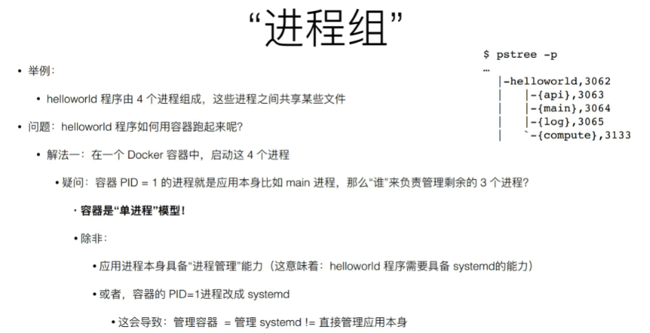

```***于是便有了Pod***```

Pod就类比这里的“进程组”。

上面例子所说的包含四个进程的HelloWorld程序，在K8S里就会被定义为拥有四个容器的Pod。四个不同的进程放到四个容器里，四个容器定义在一个Pod里。

当HelloWorld程序启动的时候，实际上可以看到四个容器，它们共享某些资源，这些资源都属于Pod。

实际上Pod在Kubernetes里只是一个逻辑单位，没有一个真实的东西是Pod。**真正物理上存在的，就是四个容器。**多个容器的组合叫做Pod。

Pod也是Kubernetes分配资源的一个单位，因为里面的容器要共享某些资源，所以Pod也是Kubernetes的原子调度单位。

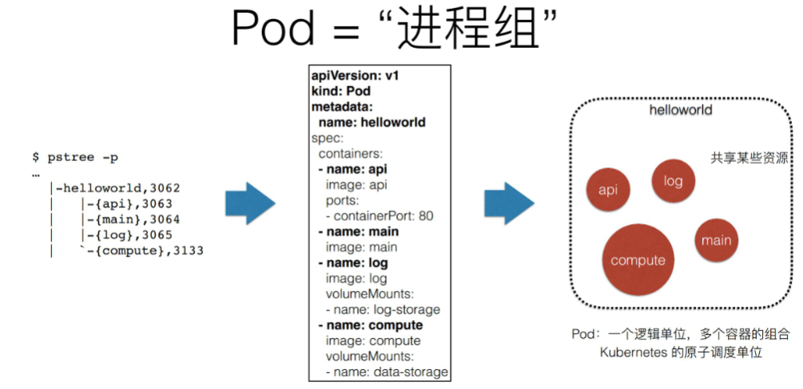

如上图的yaml文件，定义了一个Pod类型，名字是HelloWorld。可以看到里面有四个容器，name分别为api、main、log、compute。四个容器在一个叫HelloWorld的Pod里，共享某些资源。

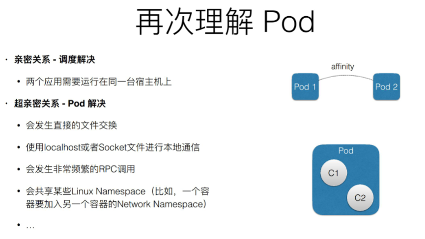

比如说现在有两个 Pod，它们需要运行在同一台宿主机上，那这样就属于亲密关系，调度器一定是可以帮助去做的。但是对于超亲密关系来说，有一个问题，即它必须通过 Pod 来解决。因为如果超亲密关系赋予不了，那么整个 Pod 或者说是整个应用都无法启动。

什么叫做超亲密关系呢？大概分为以下几类：

- 比如说两个进程之间会发生文件交换，前面提到的例子就是这样，一个写日志，一个读日志；
- 两个进程之间需要通过 localhost 或者说是本地的 Socket 去进行通信，这种本地通信也是超亲密关系；
- 这两个容器或者是微服务之间，需要发生非常频繁的 RPC 调用，出于性能的考虑，也希望它们是超亲密关系；
- 两个容器或者是应用，它们需要共享某些 Linux Namespace。最简单常见的一个例子，就是我有一个容器需要加入另一个容器的 Network Namespace。这样我就能看到另一个容器的网络设备，和它的网络信息。

像以上几种关系都属于超亲密关系，它们都是在 Kubernetes 中会通过 Pod 的概念去解决的。

现在我们理解了 Pod 这样的概念设计，理解了为什么需要 Pod。它解决了两个问题：

1. 我们怎么去描述超亲密关系；
2. 我们怎么去对超亲密关系的容器或者说是业务去做统一调度，这是 Pod 最主要的一个诉求。


### Pod的实现机制

Pod本身是一个逻辑概念，那在机器上怎么实现？

***Pod要解决的核心问题是如何让一个Pod里的多个容器之间最高效的共享某些资源和数据。***

由于容器原本是被Linux的Namespace和cgroups隔离开来的，所以实际上要解决的是要打破这些隔离，然后共享资源和数据。

所以具体的解法分为两部分： **网络和存储**

**1、共享网络**

举例：现在有个Pod，包含两个容器A和B，这两个容器要共享Network Namespace。

Kubernetes的做法是在每个Pod里面起一个小镜像Infra Container（汇编语言写的，100～200KB），它是一个永远处于“暂停”状态的容器。

有了Infra Container之后，其他容器都会通过Join Namespace的方式加入到Infra Container的Network Namespace中。所以一个Pod里面的所有容器，看到的网络视图是完全一样的。即它们看到的网络设备、IP地址、MAC地址等跟网络相关的信息其实都是同一份，这一份都来自于第一次创建的这个Infra Container。这就是Pod解决容器共享网络的解法。

显然整个Pod里面必须Infra  container第一个启动。并且整个Pod的生命周期等同于Infra Container的生命周期，与其他容器无关。（这也是为什么K8S里运行去单独更新Pod里的某一个镜像，即：做这个操作整个Pod不会重建也不会重启。这是非常重要的一个设计）

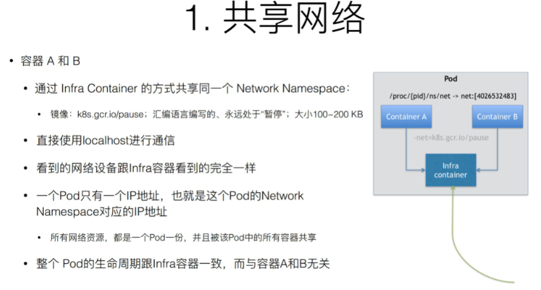

**2、共享存储**

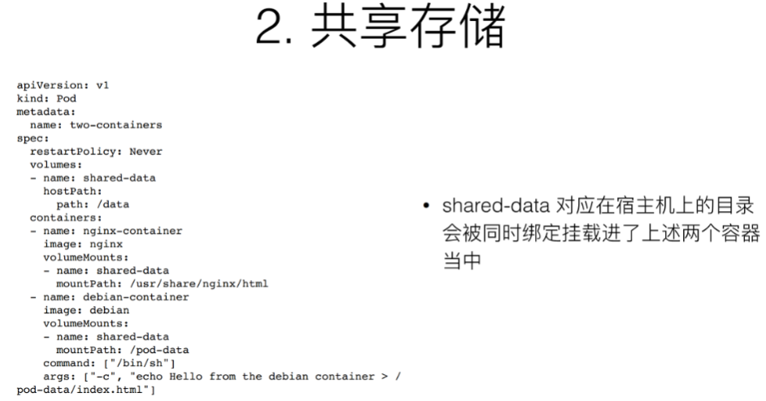

比如现在Pod里有两个容器，一个是Nginx，另一个是很普通的容器，在Nginx里放一些文件，能通过Nginx访问到，所以Nginx要share这个目录，要share文件或者目录非常简单，实际上就是把volume变成Pod level。然后同属于一个Pod的容器就都共享所有的Volume。

上图的例子中，Volume叫做shared-data，它是属于Pod level的，所以在每个容器里可以直接声明：要挂载shared-data这个volume，只要声明挂载了这个volume，在容器里看这个目录，大家看到的就是同一份。K8S就是这样解决Pod中容器共享存储的问题。


### 容器设计模式

举例：我要发布一个Java写的应用：有一个WAR包需要放到Tomcat的web APP目录下面，这样就可以把它启动起来了。那么怎么把这样一个WAR包或Tomcat去发布呢？

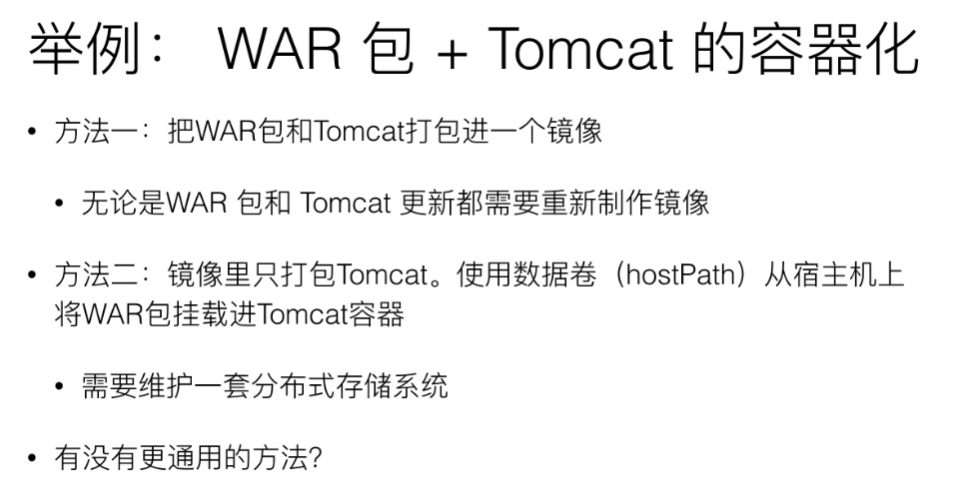

方法一：WAR包和Tomcat都打包进一个镜像里。但是这样如果之后我要单独更新WAR包或者Tomcat都要重新做镜像，很不方便。

方法二：镜像里只打包Tomcat，然后WAR包需要用数据卷/hostPath的方式从宿主机挂载到Tomcat容器的web APP目录下面。这样把容器起了之后里面就能用了。但是这样又有个问题：容器并不是每次都在一台机器上起来，第一次启动在宿主机A上，第二次启动可能就在宿主机B上，容器是可以迁移的，它的状态是不保持的。所以这样需要维护一套分布式存储系统（即使有了分布式存储系统，还需要在每次Pod启动之前，把应用启动所需要的WAR包下载到这个Volume里，然后才能被挂载使用到），使得容器不管是在宿主机A还是B上，都能找到WAR包，找到数据。显然这样的复杂度太高了，而且还依赖于一套持久化的存储插件。


所以我们需要在本地Kubernetes上，没有分布式存储的情况下也能用能发布的方式。Kubernetes里这种方式叫做**Init Container**。

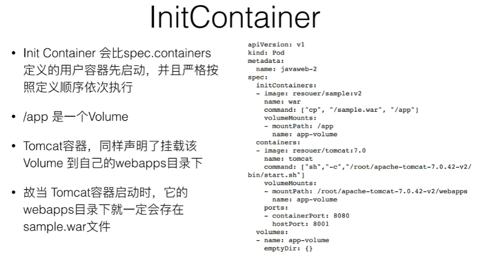

上图的yaml文件里定义了一个Init Container，这个Init Container只做一件事，就是把WAR包从镜像里拷贝到一个Volume里面，没别的了。

Init Container会比用户容器先启动，并且严格按照定义顺序来执行。

然后，这个关键在于刚刚拷贝到的这样一个目的目录：APP 目录，实际上是一个 Volume。而我们前面提到，一个 Pod 里面的多个容器，它们是可以共享 Volume 的，所以现在这个 Tomcat 容器，只是打包了一个 Tomcat 镜像。但在启动的时候，要声明使用 APP 目录作为我的 Volume，并且要把它们挂载在 Web APP 目录下面。

由于之前已经运行了Init Container，所以已经执行完WAR包的拷贝操作了，所以这个Volume中已经存在了应用的WAR包：也就是sample.war。等到第二步执行Tomcat容器的时候，去挂载这个Volume，就可以在里面找到之前拷贝进来的sample.war。

所以这个Pod就是自包含的，可以把这个Pod在任何一个Kubernetes上面顺利启动起来。不需要有分布式存储系统了。

所以这是一个通过组合两个不同角色的容器，并且按照这样一些像 Init Container 这样一种编排方式，统一的去打包这样一个应用，把它用 Pod 来去做的非常典型的一个例子。像这样的一个概念，在Kubernetes 里面就是一个非常经典的容器设计模式，叫做：“Sidecar”。

### 容器设计模式：Sidecar

Sidecar就是在Pod里面定义一些专门的容器，干一些辅助的工作。比如前面的Init Container负责把镜像里的WAR包拷贝到共享目录里面，以便Tomcat能够用起来。


还有一些其他操作：

· 比如要在容器里面执行SSH要干的一些事。可以写脚本，一些前置的条件，都可以通过像Init Container或者其他像Sidecar的方式解决。

· 日志收集本身是一个小进程/容器。可以把它打包进Pod里面去做收集工作。

· Debug应用：可以在Pod里面再将Debug应用定义为一个额外的小的Container，它可以去exec应用Pod的namespace。

· 应用监控：查看其它容器的工作状态，无需SSH登录到其他容器里查看，只要把监控组件装到额外的小容器里就可以了，然后把它作为一个sidecar启动起来，跟主业务容器进行协作。

很明显，Sidecar的一个优势就是将辅助功能和业务容器解耦，所以可以独立发布sidecar容器；另外这个能力还可以重用：同样的一个监控Sidecar或者日志Sidecar可以被全公司的人共用。


**Sidecar其他场景：**

比如说前面提到的应用日志收集，业务容器将日志写在一个 Volume 里面，而由于 Volume 在 Pod 里面是被共享的，所以日志容器 —— 即 Sidecar 容器一定可以通过共享该 Volume，直接把日志文件读出来，然后存到远程存储里面，或者转发到另外一个例子。现在业界常用的 Fluentd 日志进程或日志组件，基本上都是这样的工作方式。

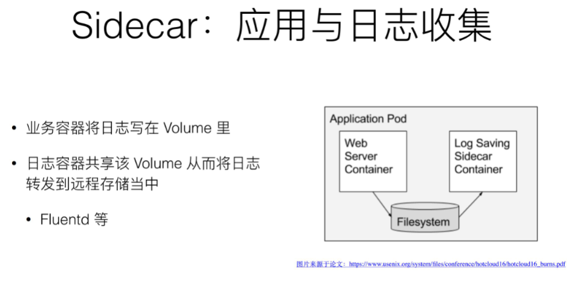


Sidecar 的第二个用法，可以称作为代理容器 Proxy。什么叫做代理容器呢？

假如现在有个 Pod 需要访问一个外部系统，或者一些外部服务，但是这些外部系统是一个集群，那么这个时候如何通过一个统一的、简单的方式，用一个 IP 地址，就把这些集群都访问到？有一种方法就是：修改代码。因为代码里记录了这些集群的地址；另外还有一种解耦的方法，即通过 Sidecar 代理容器。

简单说，单独写一个这么小的 Proxy，用来处理对接外部的服务集群，它对外暴露出来只有一个 IP 地址就可以了。所以接下来，业务容器主要访问 Proxy，然后由 Proxy 去连接这些服务集群，这里的关键在于 Pod 里面多个容器是通过 localhost 直接通信的，因为它们同属于一个 network Namespace，网络视图都一样，所以它们俩通信 localhost，并没有性能损耗。

所以说代理容器除了做了解耦之外，并不会降低性能，更重要的是，像这样一个代理容器的代码就又可以被全公司重用了。

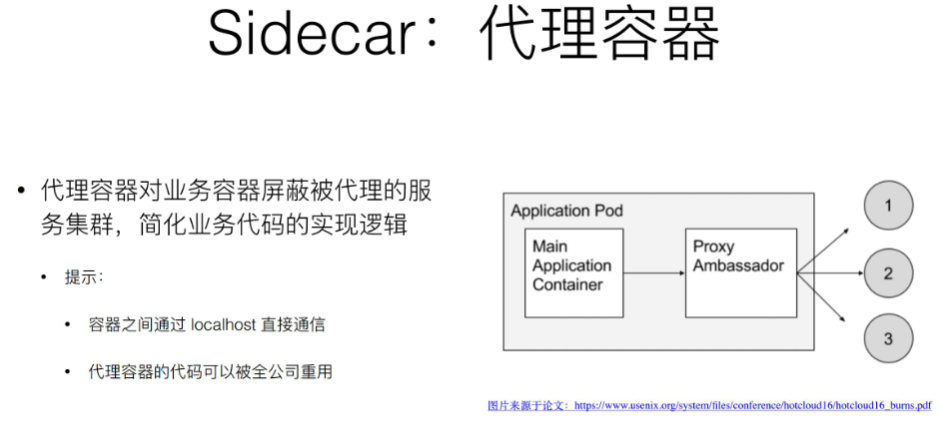


Sidecar 的第三个设计模式 —— 适配器容器 Adapter，什么叫 Adapter 呢？

现在业务暴露出来的 API，比如说有个 API 的一个格式是 A，但是现在有一个外部系统要去访问我的业务容器，它只知道的一种格式是 API B ,所以要做一个工作，就是把业务容器怎么想办法改掉，要去改业务代码。但实际上，你可以通过一个 Adapter 帮你来做这层转换。


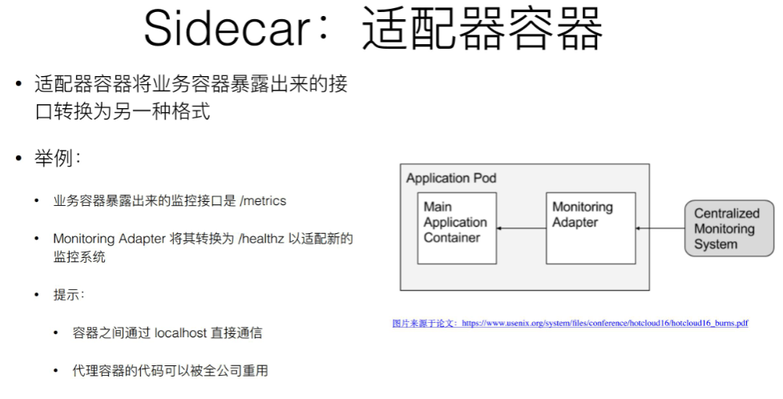
